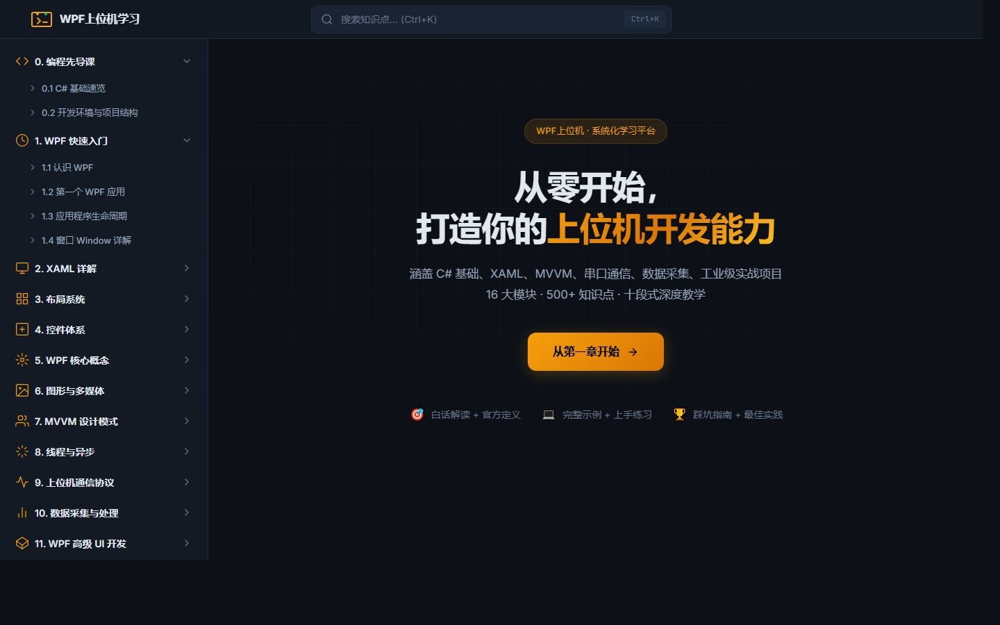

<p align="center">
  <h1 align="center">WpfSPA</h1>
  <p align="center">WPF 上位机开发 · 系统化学习平台</p>
</p>

<p align="center">
  
</p>

## 简介

WpfSPA 是一个**纯前端单页面应用（SPA）**，提供从 C# 基础到 WPF 工业级实战的完整学习路径。

- **16 大知识模块、500+ 知识点**
- **十段式深度教学法**：白话理解 → 官方定义 → 由来背景 → 核心要点 → 完整示例 → 适用场景 → 常见踩坑 → 最佳实践 → 上手练习 → 相关知识链接
- **零框架依赖**：原生 JavaScript + Vite 构建，极简高效

## 功能特性

- **课程体系**：从编程先导课到工业级实战项目，覆盖串口/Modbus/OPC UA/MQTT/Socket 等上位机核心通信协议
- **全文搜索**：`Ctrl + K` 快捷键唤醒，标题/内容权重评分排序
- **三级侧边栏**：章节 → 子分组 → 知识点，可折叠、自动定位
- **代码高亮 + 复制**：C# / XAML / JSON / Bash / PowerShell 语法高亮，一键复制
- **学习进度追踪**：localStorage 持久化，章节级 + 板块级 + 总进度
- **章节测验**：板块末章自动注入单选题，即时评分 + 解析
- **响应式设计**：支持桌面端和移动端

## 快速开始

```bash
# 安装依赖
npm install

# 启动开发服务器
npm run dev

# 构建生产版本
npm run build
```

开发服务器默认运行在 `http://localhost:5174`。

## 技术栈

| 类别 | 技术 |
|------|------|
| 构建 | Vite 6 |
| Markdown 渲染 | marked |
| 代码高亮 | highlight.js |
| 路由 | Hash-based（原生实现） |
| 样式 | 纯 CSS（CSS 变量 + 分层架构） |
| 持久化 | localStorage |

## 项目结构

```
WpfSPA/
├── index.html              # 入口 HTML
├── src/                    # JavaScript 源码
│   ├── main.js             # 应用入口
│   ├── router.js           # 路由系统
│   ├── markdown.js         # Markdown 渲染引擎
│   ├── ui.js               # UI 组件
│   ├── search.js           # 全文搜索
│   ├── progress.js         # 学习进度
│   └── quiz.js             # 章节测验
├── styles/                 # CSS 样式
│   ├── theme.css           # 设计令牌
│   ├── layout.css          # 布局系统
│   ├── markdown.css        # 正文样式
│   └── components.css      # 组件样式
└── public/content/         # 课程内容（Markdown）
    ├── meta.json           # 菜单配置
    ├── quizzes.json        # 测验数据
    └── 00~16/              # 17 个章节目录
```

## 课程大纲

| 章节 | 内容 |
|------|------|
| 00 | 编程先导课——C# 基础 + 开发环境 |
| 01 | WPF 快速入门 |
| 02 | XAML 详解 |
| 03 | 布局系统 |
| 04 | 控件体系 |
| 05 | WPF 核心概念——依赖属性/路由事件/命令/绑定/资源/模板 |
| 06 | 图形与多媒体 |
| 07 | MVVM 设计模式——CommunityToolkit / Prism |
| 08 | 线程与异步——Dispatcher / Task / async-await |
| 09 | 上位机通信——串口 / Socket / Modbus / OPC UA / MQTT |
| 10 | 数据采集与处理——SQLite / EF Core / LiveCharts / 报警 |
| 11 | WPF 高级 UI——自定义控件 / 换肤 / 多语言 / 高DPI |
| 12 | 系统架构与设计模式 |
| 13 | 性能优化与调试 |
| 14 | 工业级实战项目——温湿度监控 / PLC 看板 / SCADA / OEE / WMS |
| 15 | 部署与发布——ClickOnce / MSI |
| 16 | 开源项目与学习资源 |

## 浏览器支持

支持所有现代浏览器：Chrome、Edge、Firefox、Safari。

## 许可

[MIT](LICENSE)
